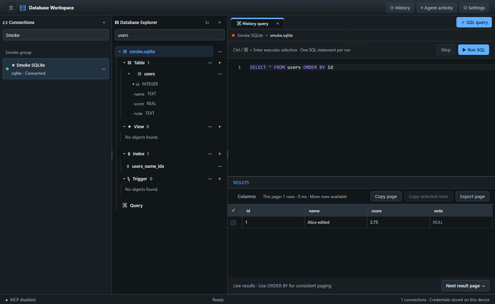
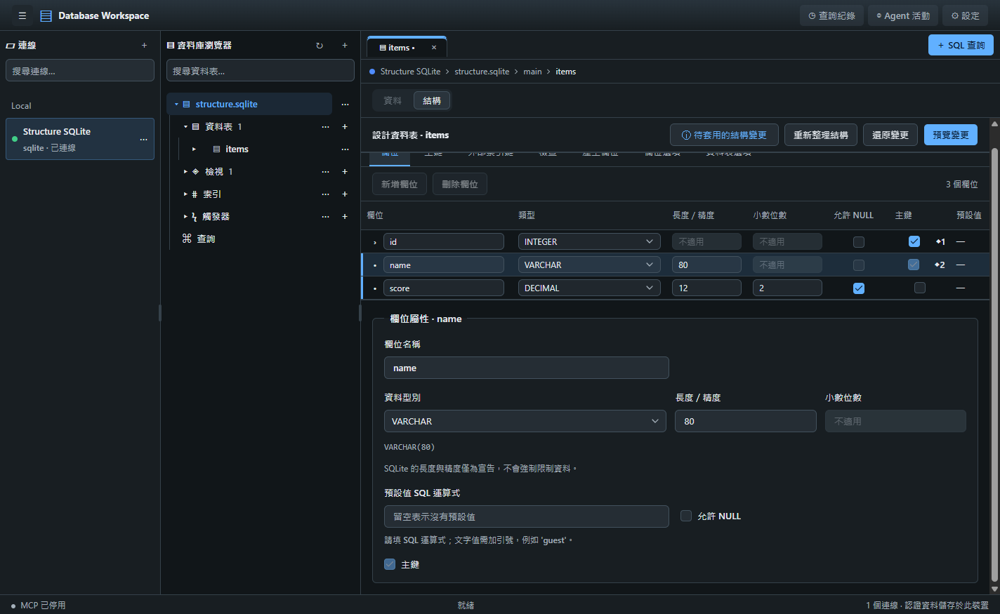
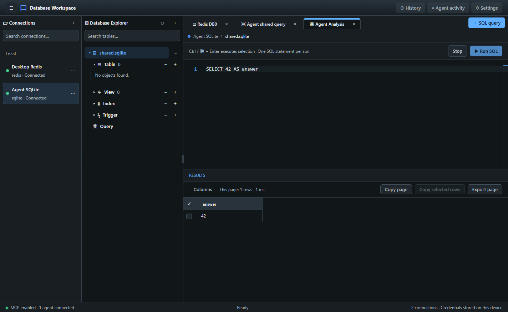

# Database Workspace

**繁體中文** · [English](README.en.md)

給人類與 AI Agent 共用的桌面資料庫工具。一個 Electron 桌面程式，瀏覽、查詢、編輯多種資料庫；同時內建本機 [MCP](https://modelcontextprotocol.io/) 伺服器，讓 AI Agent 透過**受權限與核准管控**的工具，與你共用同一個工作區。



## 特色

- **多種資料庫**：SQLite、PostgreSQL、MySQL／MariaDB、SQL Server（SQL 帳密，Windows 上另支援 Windows 驗證）、Redis；SAP／Sybase ASE 為實驗性支援（尚未在真實 ASE 驗證）。
- **查詢與資料**：Monaco SQL 編輯器與欄位／資料表補全、虛擬化的大型結果表、行內編輯、最多 30 個 AND 篩選、CSV／JSON 匯出、執行 SQL 檔案、匯出 SQL 備份。
- **結構設計**：資料表／檢視設計器、索引、觸發器、外鍵與 CHECK、產生欄位；建立、重新命名、刪除前都會預覽 SQL，並檢查物件版本。
- **Redis**：字串、Hash、List、Set、Sorted Set、Stream 與 JSON 的瀏覽與編輯，保留 TTL。
- **Agent 共用工作區**：Agent 開啟的分頁、查詢結果與你看到的同步；寫入需桌面使用者核准，所有操作留下稽核紀錄。
- **介面**：繁體中文／English、深色／淺色、可調整的三欄版面。

| 結構設計器                                        | Agent／MCP 共用工作區                          |
| ------------------------------------------------- | ---------------------------------------------- |
|  |  |

## 快速開始

需求：**Node.js 24+** 與 npm。Linux／WSL 使用者另請完成下方的 [Linux／WSL 安全儲存與啟動設定](#linuxwsl-安全儲存與啟動設定)，才能安全保存資料庫密碼。

```sh
npm ci             # 依 package-lock.json 安裝
node node_modules/electron/install.js  # 確認 Electron 執行檔已下載
npm run dev        # 開發模式啟動桌面程式
```

```sh
npm run build      # 型別檢查並建置
npm start          # 執行建置結果
npm run package    # 產生當前平台的展開應用（release/）
npm run test:packaged  # 驗證打包後的桌面／SQLite 流程
```

### 平台編譯與前置套件

建議使用 **Node.js 24 LTS**，Node／npm／原生驅動的架構應與目標應用一致。安裝需要連線至 npm registry、GitHub Electron releases 及其下載站台；`npm ci` 成功不一定代表 Electron 執行檔已下載。若啟動顯示 `Downloading Electron binary...`，先執行上面的安裝腳本，並檢查網路／代理設定。不要使用 `--ignore-scripts` 作為一般安裝方式；npm 若提示待核准的安裝腳本，先檢視並核准必要套件，勿直接允許所有未知腳本。

| 平台 | 一般建置／執行 | 選用原生 ODBC 驅動需額外準備 |
| --- | --- | --- |
| Windows | Node.js 24+、npm、可執行 Electron 的桌面環境 | SQL Server Windows 驗證需 Microsoft ODBC Driver 18；若缺少相符預編譯檔而需從原始碼編譯，另裝 Python 3、Visual Studio 2022 Build Tools（Desktop development with C++／Windows SDK） |
| macOS | Node.js 24+、npm；打包工具建議先備妥 Xcode Command Line Tools（`xcode-select --install`；已有完整 Xcode 不需重複安裝） | `brew install unixodbc`；缺少預編譯檔時另需 Python 3 與 C++ 工具鏈。目前 arm64 預編譯檔依賴 `/opt/homebrew/opt/unixodbc/lib/libodbc.2.dylib` |
| Linux | Node.js 24+、npm、GTK／NSS／音效／GBM 等 Electron 系統函式庫與桌面顯示環境；無螢幕測試需 Xvfb | unixODBC；從原始碼編譯另需 Python 3、make、支援 C++20 的編譯器與 unixODBC 開發標頭 |

Ubuntu 24.04 的一般執行環境可先安裝（其他發行版請使用對應套件名稱）：

```sh
sudo apt-get update
sudo apt-get install libgtk-3-0 libnss3 libasound2t64 libgbm1 libxss1 libatk-bridge2.0-0 libdrm2
# 僅在需要原生 ODBC 編譯／無螢幕桌面測試時：
sudo apt-get install build-essential python3 unixodbc-dev xvfb
```

`msnodesqlv8` 是**選用套件**，缺少時不會阻止一般建置或 SQLite／PostgreSQL／MySQL／SQL Server SQL 帳密／Redis 操作。若需要 ASE ODBC，必須先安裝 unixODBC（macOS／Linux）及合法取得的 SAP ASE ODBC 驅動；Windows 驗證僅在 Windows 開放。安裝選用驅動失敗時，補齊系統依賴後重跑 `npm ci --foreground-scripts`，再用以下命令確認可以載入，不能只以 npm 成功退出判定：

```sh
node -e "require('msnodesqlv8'); console.log('Native ODBC bridge loaded')"
```

原生驅動需在**目標作業系統與架構**建置／驗證；打包設定 `npmRebuild: false` 不會替你修復缺失或錯誤架構的原生模組。一般功能不需要安裝 Microsoft ODBC 或 SAP 驅動。

其他工具依功能選裝，並非一般編譯前置需求：

- 真實資料庫整合測試：Docker Desktop／Docker Engine 必須已啟動；Apple Silicon 上 SQL Server 測試映像可能另受 amd64 模擬相容性限制。
- PostgreSQL SQL 匯出：安裝相容伺服器版本的 `pg_dump`（macOS 可用 Homebrew `libpq`，需加入 PATH 或在連線設定指定絕對路徑）。
- SQL Server SQL 匯出：PowerShell 與可載入的 `SqlServer` 模組；非 Windows 需 `pwsh`。
- ASE JDBC／匯出：JDK 11+、合法取得的 SAP `jconn4.jar`；原生結構匯出另需 `DDLGen.jar`。ASE 仍為實驗性支援，真機未驗收。

### Linux／WSL 安全儲存與啟動設定

**Linux 不一定需要特殊啟動參數，但必須有可用且已解鎖的安全憑證儲存服務。** 已有 GNOME Keyring／KWallet 的桌面環境可能不需要額外設定；WSLg 提供圖形視窗，不代表已配置 keyring。Electron 系統函式庫與顯示服務用來啟動視窗，keyring 則用來安全保存密碼，是兩個不同的前置條件。

以下以 **Ubuntu 24.04／WSL2＋WSLg、GNOME Keyring** 為例；其他 Linux 桌面請沿用適合自己的安全 backend，不要一律強制使用 GNOME。

#### 1. 一次性準備

先確認 WSLg 或其他顯示服務可用，並安裝前述 Electron 系統函式庫。專案相依與 Electron 執行檔的安裝方式見「快速開始」。若尚未有安全儲存服務，在自己的終端安裝：

```sh
sudo apt-get update
sudo apt-get install gnome-keyring libsecret-1-0 libsecret-tools seahorse
```

套件通常只需安裝一次，不必每次啟動程式都重新安裝。

#### 2. 啟動並解鎖 keyring

```sh
gnome-keyring-daemon --start --components=secrets
seahorse
```

在 Seahorse 建立或解鎖預設密碼 keyring，設定**非空的主密碼**。WSL 工作階段可能沒有桌面登入的自動解鎖流程，重新登入／重啟 WSL 後需確認服務仍在運作且 keyring 已解鎖；已自動啟動並解鎖時不用重複操作。

**不要把 sudo／keyring 密碼提供給 Agent、寫入專案或環境變數，也不要以空密碼 keyring 或 `--password-store=basic` 繞過保護。** 本專案拒絕 `basic_text` 後端，不提供明文備援。

#### 3. 驗證安全儲存

在專案根目錄執行：

```sh
npm run check:secure-storage
# 預設 backend 不可用時，明確檢查 GNOME libsecret：
npm run check:secure-storage -- --password-store=gnome-libsecret
```

指定 libsecret 的成功結果應包含以下內容，且命令退出碼為 **0**：

```json
{
  "backend": "gnome_libsecret",
  "available": true,
  "roundtrip": true
}
```

檢查使用真正 Electron、隔離設定檔與非機密測試字串，不讀取既有密碼。若仍顯示 `available: false`、`roundtrip: false` 或逾時，先確認 keyring 服務及解鎖狀態，不要只因安裝成功就視為可用。

#### 4. 使用通過檢查的 backend 啟動

如果預設檢查通過，可使用一般 `npm start`。**目前已驗證的 WSL 環境預設仍選到 `basic_text`，需明確指定 libsecret：**

```sh
npm run build
npm start -- --password-store=gnome-libsecret
```

`npm run build` 在初次執行或原始碼變更後執行即可，不必每次啟動都重建。開發模式可為該程序提供 GNOME 桌面識別；先確認相同環境設定下的檢查通過，再啟動：

```sh
XDG_CURRENT_DESKTOP=GNOME npm run check:secure-storage
XDG_CURRENT_DESKTOP=GNOME npm run dev
```

本次 WSL 已驗證指定 libsecret 的正式程式可以保存加密憑證，且重新啟動後仍可解密；開發模式的上述桌面識別方式需依自己的環境確認。切換 backend 前，確保原本的 keyring 仍可存取，不保證不同 backend 能解密既有憑證。

詳細設定與限制見 [使用與開發指南](docs/USER_GUIDE.md#linuxwsl-執行與安全憑證儲存)，驗收結果見 [WSL keyring 安全儲存驗收](report/REPORT-2026-10-03T06-52-37-782Z.md)。

### 打包與發布

`npm run package` 使用 `electron-builder --dir`，不是安裝映像，也不會上傳發布。輸出通常為 Windows `release/win-unpacked/`、macOS arm64 `release/mac-arm64/Database Workspace.app`（x64 為 `release/mac/`）、Linux `release/linux-unpacked/`。散布展開應用時需保留整個輸出資料夾。

若要建立安裝檔，先完成建置，再於對應平台執行：

```sh
npm run build
# 下列選擇當前平台；均不會上傳：
npx electron-builder --mac dmg --arm64 --publish never  # Intel Mac 改用 --x64
npx electron-builder --win nsis --x64 --publish never
npx electron-builder --linux AppImage --x64 --publish never
```

首次產製安裝檔還會從 GitHub `electron-userland/electron-builder-binaries` 下載封裝工具；慢速網路可能需等待數分鐘，請確認該站台與下載站台可連線。若需手動準備 macOS `dmgbuild`，必須先核對 electron-builder 該版本指定的官方 SHA-256，再以 `CUSTOM_DMGBUILD_PATH` 指向其絕對路徑，不要使用來源不明的執行檔。

macOS 的一般外部分發另需有效 **Developer ID Application** 憑證、Apple 公證認證及 Gatekeeper 驗證；無憑證的本機打包不等於可供一般使用者安裝的正式發行。Windows 正式分發建議使用發行者簽章；Linux AppImage 執行可能需 FUSE 2 相容套件。不要將簽章／公證憑證或密碼放入版控。

Windows 有既有驗證紀錄；本次 macOS arm64 已通過型別檢查、一般測試、建置、桌面／發行包 smoke，並成功產製未簽章 DMG、驗證核對碼及掛載後執行（詳見[修復報告](report/REPORT-2026-10-03T04-40-41-726Z.md)）。Linux 與其他架構仍需在目標平台執行同等驗證；真實網路資料庫整合與正式簽章／公證發布尚未在本次環境驗收。

## 讓 AI Agent 使用（MCP）

MCP 預設**停用**，且只監聽本機。在 _Settings → Agent / MCP_ 啟用並取得 token 後，於 MCP client 設定 Streamable HTTP：

```json
{
  "url": "http://127.0.0.1:7799/mcp",
  "headers": { "Authorization": "Bearer <desktop-generated-token>" }
}
```

- 每個連線可個別設為 **停用／唯讀／讀寫**。
- Agent 的寫入會回傳 `approvalId`，須由桌面使用者核准原始操作，Agent 無法自行核准；破壞性操作每次都要核准。
- 資料庫密碼與 token 只存在桌面端，不會出現在工具結果、稽核或錯誤訊息中。

完整工具清單、授權範圍與限制見 [使用與開發指南](docs/USER_GUIDE.md#mcp)。

## 安全

- 連線憑證以作業系統的加密儲存（Electron `safeStorage`）保存，沒有明文備援。
- Renderer 啟用 `contextIsolation` 與 sandbox，只能透過固定的 IPC 介面存取主程序。
- 發現安全問題請參閱 [SECURITY.md](SECURITY.md)，**請勿**在公開 issue 貼出漏洞細節。

## 開發與測試

```sh
npm run typecheck          # 型別檢查
npm test                   # 單元測試（不需要資料庫）
npm run integration:up     # 啟動 Docker 測試資料庫（PostgreSQL／MySQL／MariaDB／SQL Server／Redis）
npm run test:integration   # 真實資料庫整合測試
npm run test:desktop:all   # 桌面（Electron）煙霧測試
npm run integration:stop
```

`npm test` 會略過所有需要真實資料庫的測試，**綠燈不代表資料庫整合已驗證**。整合測試的密碼由 `integration:up` 產生在被忽略版控的 `.local/integration.env`。更多細節見[使用與開發指南](docs/USER_GUIDE.md#真實資料庫整合測試)。

### 專案結構

| 路徑                   | 內容                                 |
| ---------------------- | ------------------------------------ |
| `src/main/application` | Command Bus、Event Bus、各項服務     |
| `src/main/database`    | SQL 產生器與各資料庫 adapter         |
| `src/main/mcp`         | MCP 伺服器、權限、核准與稽核         |
| `src/main/credentials` | 憑證加密儲存                         |
| `src/preload`          | 固定的 IPC 橋接                      |
| `src/renderer`         | React 介面（Monaco、TanStack Table） |
| `tests`、`scripts`     | 單元／整合測試與桌面煙霧測試         |

GUI 與 MCP 共用同一個 Command Bus、權限層與服務；新增資料操作時請沿用它們，不要繞過權限或從 renderer 直接操作資料庫。

## 文件

文件索引在 [docs/README.md](docs/README.md)：使用與開發指南、各功能說明、各資料庫的支援與限制、新增資料庫引擎的規格，以及歷史設計與實作紀錄。

## 貢獻

歡迎 issue 與 pull request，請先閱讀 [CONTRIBUTING.md](CONTRIBUTING.md)。

## 授權

[MIT](LICENSE)
